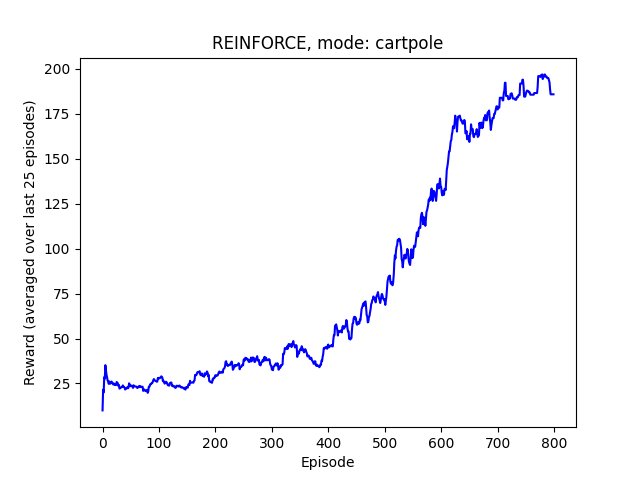
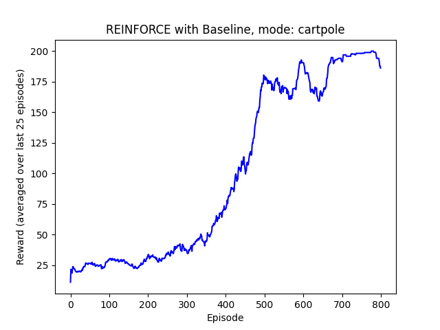
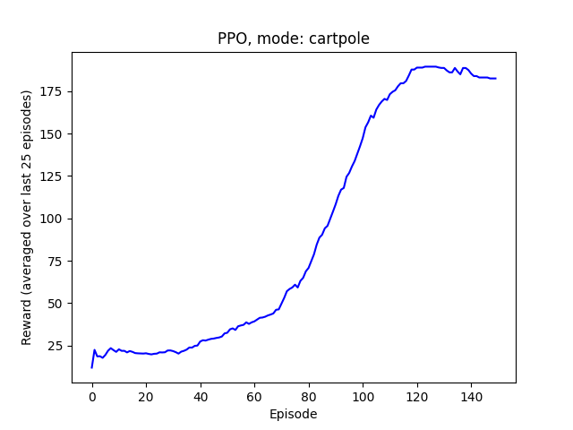
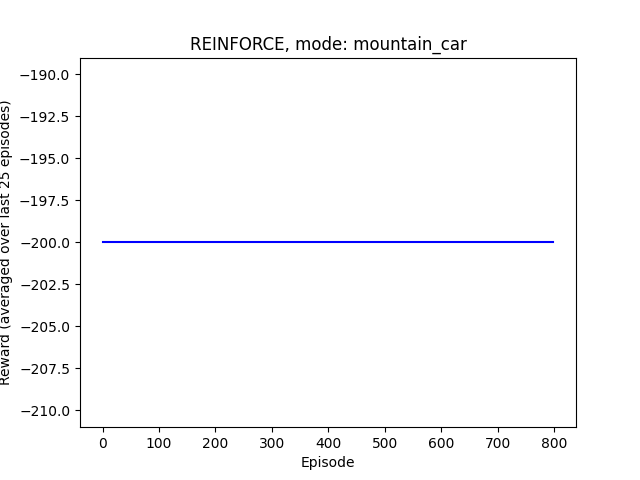
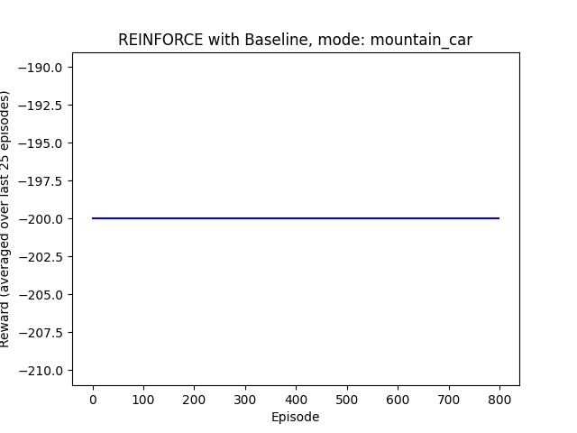
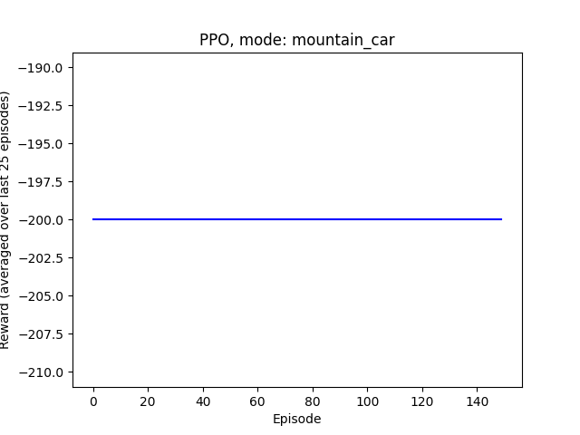
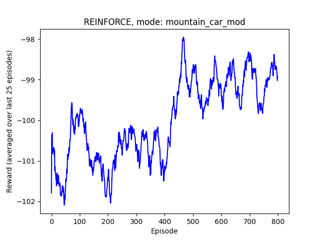
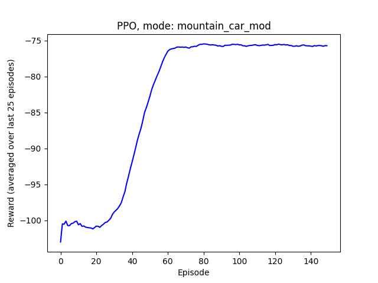

# CS885 Assignment 2 

## Part I：Bandit & Model-Based RL

### 1.迷宮問題：Model-Based vs. Q-Learning

* **Model-Based RL :** Model-based RL 是學習環境模型（Transition $T(s, a, s')$ 和 Reward $R(s, a)$），一但有了模型，就可以直接進行planning。

* **Q-learning :** Q-learning 則是model-free的方法，他不會學習環境的 Transition 和 Reward，而是透過大量的試錯 (Trial-and-Error) 從經驗中學習如何估計Q-value。

* 由結果可以觀察出，model-based RL能有較快的收斂速度，但只要給Q-learning訓練次數，他也能夠學到接近最佳的策略。

### 2.多臂拉霸機問題 : 
* **epsilon-greedy :** 它的探索是隨機的，它會以 $\epsilon$ 的機率隨機選一個arm。他在最初時 $\epsilon=1$ ，也就是一定會隨機選取一個arm去拉下，而在一定回合後， $\epsilon$ 會逐漸下降，而agent會以 $\epsilon$ 的機率去探索，並以 $1-\epsilon$ 的機率去選取目前有最高期望值的arm去拉下。
* **Thompson Sampling :** 它的探索是基於機率的 (probabilistic)。它為每個臂的獎勵機率維持 Beta distribution，然後從分佈中採樣。若是沒有或的獎勵，則會增加相對應動作的 $\beta$ 值，反之，若成功獲得獎勵，則增加相對應動作的 $\alpha$ 值。
* **UCB (Upper Confidence Bound) :** 這是一種「在不確定性面前保持樂觀」的策略。它在做決策時，會選擇那個**「潛在上界」**最高的 arm。
  * 決策方式： 它會選擇能最大化 $\hat{Q}(a) + U(a)$ 的 arm $a$。
    * $\hat{Q}(a)$ 是 arm $a$ 目前的平均獎勵（利用 exploitation）。
    * $U(a)$ 是 arm $a$ 的不確定性獎勵（探索 exploration）。
  * 不確定性獎勵 $U(a)$： 這個獎勵值與 $\sqrt{\frac{\ln t}{N(a)}}$ 成正比（其中 $t$ 是總回合數，$N(a)$ 是 arm $a$ 被拉過的次數）。
  * 這代表如果一個 arm 很久沒被拉過（$N(a)$ 很小），它的 $U(a)$ 會變得非常高，UCB 就會「好奇地」去拉它，這就是探索。如果一個 arm 經常被拉（$N(a)$ 很大），它的 $U(a)$ 會變很小，這時決策就主要依賴 $\hat{Q}(a)$（平均獎勵），這就是利用。
*  理論上，UCB 和 Thompson Sampling 這種「更聰明」的探索策略，會比 $\epsilon$-Greedy 這種「隨機」探索策略更快地找到最佳臂，從而在整個過程中獲得更高的累積獎勵。

## Part II：REINFORCE (w/o baseline) & PPO

* REINFORCE核心方法： 最基礎的策略梯度 (Policy Gradient) 演算法。
  * 運作方式： 它直接使用「未來總回報 $G_t$」來作為更新策略的權重。如果 $G_t$ 高，就增加該軌跡 (trajectory) 中所有動作的機率；如果 $G_t$ 低，就降低它們的機率。
  * 主要特性： 高變異性 (High Variance)。由於 $G_t$ 的值在不同 episodes 間波動極大，導致梯度訊號非常吵雜 ，學習過程很不穩定且樣本效率低。
* REINFORCE with Baseline核心方法： REINFORCE 的改良版，旨在減少變異性 (Variance Reduction)。
  * 運作方式： 它引入一個「Baseline」 $V(s_t)$（狀態價值函數）。它不再使用 $G_t$，而是使用「優勢函數 $A_t = G_t - V(s_t)$」來當作權重。
  * 主要特性： 梯度訊號更穩定。這使得學習過程更平穩，收斂效果通常遠優於標準的 REINFORCE。
* PPO (Proximal Policy Optimization)核心方法： 一種先進的策略梯度演算法，兼顧穩定性與樣本效率。
  * 運作方式： 它同樣使用「優勢函數 $A_t$」（已包含 Baseline）。其關鍵不同是使用「裁剪 (Clipping)」來限制策略更新的幅度，確保新舊策略之間的差異不會太大。
  * 主要特性： 高樣本效率且非常穩定。由於更新是漸進且穩定的，PPO 可以在同一批數據上安全地更新多次 (multiple epochs)，因此學習速度遠快於 REINFORCE。

### 1.CartPole

在 CartPole 環境中，獎勵是密集的（每存活一步，獎勵+1）。
* PPO 展現了極高的樣本效率 ，僅用了約 150 個 episodes 就達到了 REINFORCE 需要 800 個 episodes 才能達到的水平。這是因為 PPO 使用「裁剪 (Clipping)」來確保更新的穩定性，使其可以在同一批數據上安全地更新多次 (multiple epochs)。
* REINFORCE 學習最慢。這是因為它直接使用 $G_t$（未來總回報）來更新，而 $G_t$ 本身具有高變異性 (High Variance)，導致梯度訊號非常吵雜，學習過程不穩定。
* REINFORCE with Baseline 通過引入 $V(s_t)$ 並使用「優勢函數 $A_t$」來減少變異性，使得學習曲線比標準 REINFORCE 更穩定，但其樣本效率與 REINFORCE 一樣低，因為它仍然是一種 On-Policy 算法，每批數據只能更新一次。

### 2. MountainCar 標準版

標準 MountainCar 環境中，獎勵是稀疏的（每一步 -1，直到 200 步或達到目標時獎勵 0）。
* -200 的獎勵意味著 agent 在所有 episodes 中都從未成功達到山頂的目標。它只是活滿了 200 步（-1 * 200 = -200）然後 episode 終止。

### 3. MountainCar 修改版

這個版本中，獎勵被改為車子的高度，這是一個密集的獎勵。
* PPO 再次展現了最強的性能和最高的樣本效率，迅速利用這個密集的獎勵訊號學會了策略。
* 最關鍵的比較： REINFORCE vs. REINFORCE with Baseline。
  * 這個實驗完美地展示了 Baseline 的巨大價值。
  * REINFORCE 雖然現在有了密集的獎勵，但這個獎勵被 $G_t$ 的高變異性所干擾。梯度訊號的噪聲 (noise) 依然太大，導致算法無法有效學習。
  * REINFORCE with Baseline 通過使用優勢函數 $A_t = G_t - V(s_t)$，成功減少了變異性。它「過濾」掉了噪聲，讓 agent 能夠清楚地辨識出「使高度增加」的有用梯度，從而穩定地學會了策略。
  

